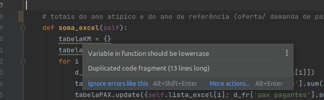

# Projeto-SMTR

Calcula tarifa de equilíbrio (Tarifa_Equilíbrio_v4.py)

## Sugestões

1. README em imagens? Talvez fazer aqui direto para permitir evoluções/alterações
2. Correções de forma da PYCHARM. Vários. De fato, acho que facilita a visualização do código.

3. 